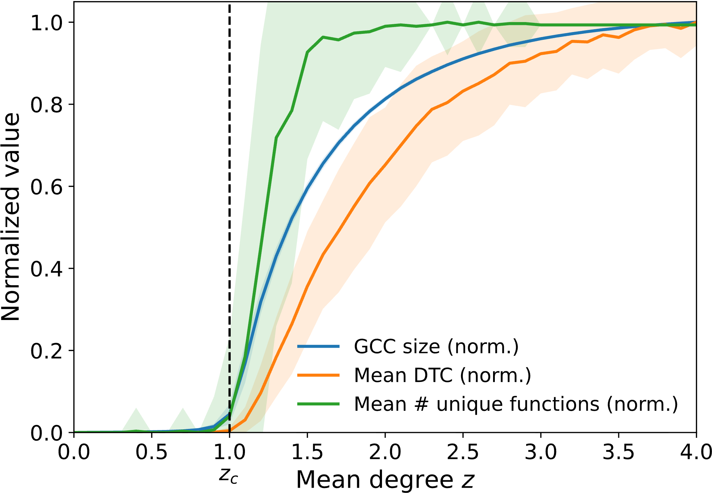
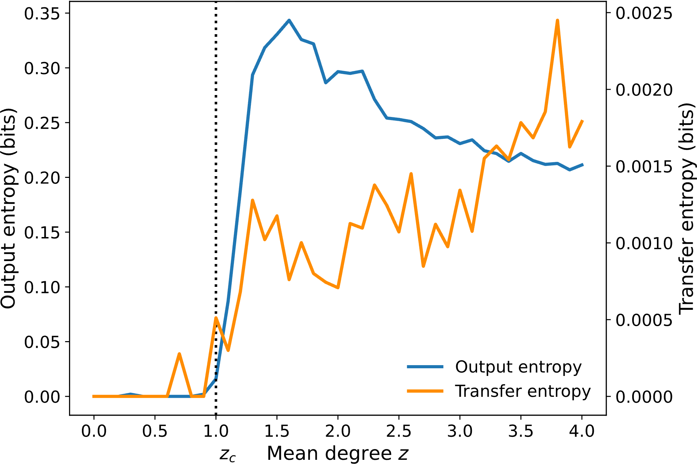

# Functional Percolation

**A theory of how information processing emerges in networked systems**


<figure>
  <div style="
    display:flex;
    gap:12px;
    align-items:flex-start;
    flex-wrap:wrap;
    background:white;
    padding:12px;
    border-radius:6px;
  ">
    
    
  </div>

  <figcaption style="margin-top:10px; font-size:0.95em; line-height:1.35;">
    <strong>Functional percolation: A connectivity threshold for the onset of system-level information processing.</strong>
    <em>Left:</em> As mean degree <code>z</code> crosses the structural percolation threshold <code>z_c</code>, the giant connected component turns on, and—at the same point—typical functional complexity (mean decision-tree complexity, DTC) and functional diversity (mean number of unique Boolean input–output response functions realized by the cascade network) rise sharply; fluctuations peak near criticality.
    <em>Right:</em> Information-theoretic signatures show the same onset: Output entropy and directed information flow (transfer entropy) increase sharply near <code>z_c</code>, with output entropy peaking near criticality while transfer entropy continues to grow with connectivity.
    <br><br>
    <strong>Relevance to “Crossing the Functional Desert”:</strong>
    These same near-critical signatures mark the narrow regime where cascades are system-spanning without saturating—supporting persistent, discriminative response mappings (an “oasis”) rather than sparse, transient mappings below threshold (the “functional desert”).
    This is the proposed feasibility transition: once connectivity/thresholded propagation are sufficient, exploration in exponentially branching spaces can become physically supported via persistence and bias.
    <br><br>
    Papers:
    <a href="https://arxiv.org/abs/2512.09317">Functional Percolation (2025)</a> ·
    <a href="https://arxiv.org/abs/2601.06272">Crossing the Functional Desert (2026)</a> ·
    <a href="https://doi.org/10.1038/s41598-022-19218-0">Spontaneous emergence of computation in network cascades (Sci Rep, 2022)</a>.
  </figcaption>
</figure>


<figure>
  <div style="display:flex; gap:16px; align-items:flex-start; flex-wrap:wrap;">
    
    
  </div>

  <figcaption style="margin-top:10px; font-size:0.95em; line-height:1.35;">
    <strong>Functional percolation: A connectivity threshold for the onset of system-level information processing.</strong>
    <em>Left:</em> As mean degree <code>z</code> crosses the structural percolation threshold <code>z_c</code>, the giant connected component turns on, and—at the same point—typical functional complexity (mean decision-tree complexity, DTC) and functional diversity (mean number of unique Boolean input–output response functions realized by the cascade network) rise sharply; fluctuations peak near criticality.
    <em>Right:</em> Information-theoretic signatures show the same onset: Output entropy and directed information flow (transfer entropy) increase sharply near <code>z_c</code>, with output entropy peaking near criticality while transfer entropy continues to grow with connectivity.
    <br><br>
    <strong>Relevance to “Crossing the Functional Desert”:</strong>
    These same near-critical signatures mark the narrow regime where cascades are system-spanning without saturating—supporting persistent, discriminative response mappings (an “oasis”) rather than sparse, transient mappings below threshold (the “functional desert”).
    This is the proposed feasibility transition: once connectivity/thresholded propagation are sufficient, exploration in exponentially branching spaces can become physically supported via persistence and bias.
    <br><br>
    Papers:
    <a href="https://arxiv.org/abs/2512.09317">Functional Percolation (2025)</a> ·
    <a href="https://arxiv.org/abs/2601.06272">Crossing the Functional Desert (2026)</a> ·
    <a href="https://doi.org/10.1038/s41598-022-19218-0">Spontaneous emergence of computation in network cascades (Sci Rep, 2022)</a>.
  </figcaption>
</figure>


---

### Why this project exists

How does *function* arise from raw interactions?

Across biology, physics, and social systems, complex behavior emerges from many simple components. But most theories focus on **structure** (networks, connectivity) or **dynamics** (chaos, criticality) — not on the emergence of **information-processing function itself**.

**Functional Percolation** proposes a new answer:

> When interaction networks cross a critical connectivity threshold, they don’t just become large —
> they become *capable of computing, accumulating, and stabilizing functional responses.*

This repository contains the simulation code supporting a unified theoretical framework showing how:

• Cascades can compute Boolean functions
• Functional diversity peaks near criticality
• Information-processing motifs arise spontaneously
• Persistence and accumulation become dynamically possible
• Combinatorial feasibility barriers can be softened

Together, these results suggest a **general physical mechanism for the emergence of information processing** in many systems — from neural networks to prebiotic chemistry.

---

## The Three Papers (How They Fit Together)

### 1. *Spontaneous emergence of computation in network cascades* (Scientific Reports, 2022)

**Foundational result**

This paper shows that simple threshold networks undergoing cascades can **spontaneously compute Boolean functions** on their inputs — without learning, design, or optimization.

Key findings:

• Logical “motifs” emerge naturally
• Complex functions arise near percolation
• Functional diversity follows symmetry principles
• Computation is a generic outcome of cascades

This establishes that **information processing is not rare** — it is a natural consequence of interaction dynamics.

**Reference:**
Wilkerson, Moschoyiannis & Jensen (2022)
[https://doi.org/10.1038/s41598-022-19218-0](https://doi.org/10.1038/s41598-022-19218-0)


---

### 2. *Functional Percolation: A Perspective on Criticality of Form and Function* (arXiv, 2025)

**Theoretical framework**

This paper introduces the concept of **functional percolation**:

> A phase transition in which networks gain the ability to support persistent, structured functional responses.

It reframes criticality not just as a structural phenomenon (giant components), but as a **functional transition** where:

• Information can propagate reliably
• Input–output mappings stabilize
• Functional motifs become reusable
• Computation becomes system-level

This paper lays the **conceptual foundation** for treating function as a percolating property.

**Reference:**
Wilkerson (2025)
[https://arxiv.org/abs/2512.09317](https://arxiv.org/abs/2512.09317)

---

### 3. *Crossing the Functional Desert: Critical Cascades and a Feasibility Transition for the Emergence of Life* (arXiv, 2026)

**Application to abiogenesis**

This paper applies functional percolation to the **origin of life problem**:

How can persistent functional organization arise in vast combinatorial chemical spaces?

It shows that:

• Below critical connectivity → functional responses are transient
• Near criticality → persistent functional mappings emerge
• Cascades introduce bias and weak accumulation
• Feasibility barriers are reduced dynamically

The result is a **substrate-agnostic mechanism** for how early life could begin accumulating functional structure *without* needing improbable chemical luck.

**Reference:**
Wilkerson (2026)
[https://arxiv.org/abs/2601.06272](https://arxiv.org/abs/2601.06272)

---

## What This Repository Contains

This repo implements the simulation tools used across these works:

• Linear Threshold Model (LTM) cascades
• Boolean function extraction
• Decision Tree Complexity (DTC)
• Functional diversity measurements
• Percolation scans over network density
• Entropy and function-distribution analysis

Key scripts:

| File                                   | Purpose                               |
| -------------------------------------- | ------------------------------------- |
| `ltm_core.py`                          | Network + cascade engine              |
| `ltm_boolean_mc.py`                    | Boolean function extraction           |
| `generate_dtc_figures_mean_std_GPU.py` | Functional complexity vs connectivity |
| `generate_entropy_figures.py`          | Entropy of functional distributions   |

All simulations are designed to run efficiently on CPU or GPU.

---

## Core Idea: Functional Percolation

Traditional percolation theory asks:

> When does a giant connected component form?

Functional percolation asks:

> When does a system become capable of **processing and stabilizing information**?

The answer: **near the critical threshold**.

At this point, networks gain:

• Long-range propagation
• Functional motif reuse
• Persistent response patterns
• Biased accumulation
• Increased functional diversity

This represents a **transition in computational capability**, not just connectivity.

---

## Why This Matters

Functional percolation offers a **general theory of information emergence** that applies to:

• Neural systems
• Genetic networks
• Social cascades
• Reaction networks
• Artificial computation
• Prebiotic chemistry

Instead of requiring special design, learning, or tuning, **function arises naturally** from:

> Interactions + thresholds + connectivity + cascades

---

## How to Use the Code

1. Install dependencies
2. Run a percolation scan
3. Generate functional statistics
4. Plot results

Example:

```bash
python generate_dtc_figures_mean_std_GPU.py
```

Outputs are saved to `./data/` and `./data/figures/`.

---

## Citation

If you use this work, please cite:

Wilkerson, G.J. (2026)
*Crossing the Functional Desert*
[https://arxiv.org/abs/2601.06272](https://arxiv.org/abs/2601.06272)

Wilkerson, G.J. (2025)
*Functional Percolation*
[https://arxiv.org/abs/2512.09317](https://arxiv.org/abs/2512.09317)

Wilkerson, G., Moschoyiannis, S., & Jensen, H.J. (2022)
*Spontaneous emergence of computation in network cascades*
[https://doi.org/10.1038/s41598-022-19218-0](https://doi.org/10.1038/s41598-022-19218-0)
