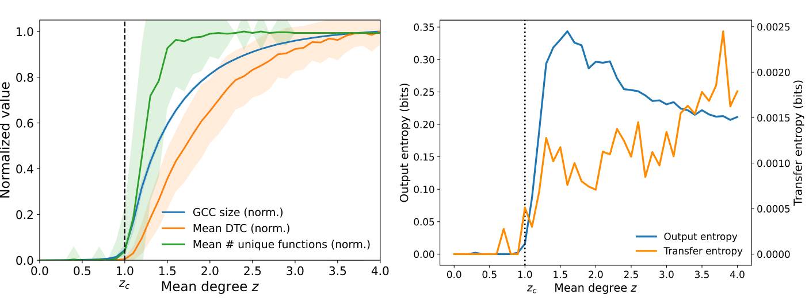

# Functional Percolation

**A theory of the emergence of information processing in networked systems**


<figure>
  <div style="display:flex; align-items:flex-start; flex-wrap:wrap;">
    
  </div>

<figcaption style="margin-top:10px; font-size:0.95em; line-height:1.35;">
  <strong>Functional percolation: A connectivity threshold for the onset of cascade-based information processing.</strong>
  <em>Left:</em> As mean degree <code>z</code> crosses the structural percolation threshold <code>z<sub>c</sub></code>,
  a giant connected component forms, enabling cascades to propagate system-wide.
  At the same point, the functional complexity of cascade responses (mean decision-tree complexity, DTC)
  and functional diversity (the number of distinct Boolean input–output response functions realized by the network)
  rise sharply, with large fluctuations near criticality.
  <em>Right:</em> Information-theoretic measures show the same transition:
  output entropy and directed information flow (transfer entropy) increase as cascades become system-spanning,
  with entropy peaking near criticality while transfer entropy continues to grow with connectivity.
  <br><br>
  <strong>Relevance to “Crossing the Functional Desert”:</strong>
  These near-critical signatures identify the narrow regime where cascades are system-spanning without saturating,
  allowing networks to support persistent, discriminative functional responses rather than sparse, transient ones.
  This “functional percolation” regime constitutes a feasibility transition:
  once connectivity and thresholded propagation are sufficient, structured responses can recur over short coherence
  timescales, enabling biased accumulation in exponentially branching spaces.
  <br><br>
  Papers:
  <a href="https://arxiv.org/abs/2512.09317">Functional Percolation (2025)</a> ·
  <a href="https://arxiv.org/abs/2601.06272">Crossing the Functional Desert (2026)</a> ·
  <a href="https://doi.org/10.1038/s41598-022-19218-0">Spontaneous emergence of computation in network cascades (Sci Rep, 2022)</a>.
</figcaption>


</figure>


---

### Why this project exists

How does *function* arise from raw interactions?

Across biology, physics, and social systems, complex behavior emerges from many simple components. But most theories focus on **structure** (networks, connectivity) or **dynamics** (chaos, criticality) — not on the emergence of **information-processing function itself**.

**Functional Percolation** proposes a new answer:

> When interaction networks cross a critical connectivity threshold, they don’t just become large —
> they become *capable of computing, accumulating, and stabilizing functional responses.*

This repository contains the simulation code supporting a unified theoretical framework showing how:

• Cascades can compute Boolean functions
• Functional diversity peaks near criticality
• Information-processing motifs arise spontaneously
• Persistence and accumulation become dynamically possible
• Combinatorial feasibility barriers can be softened

Together, these results suggest a **general physical mechanism for the emergence of information processing** in many systems — from neural networks to prebiotic chemistry.

---

## Background & Motivation

Percolation is one of the most fundamental processes in statistical physics and network science.
It describes how large-scale connectivity emerges from local interactions when a system crosses a critical threshold.
Below this threshold, components remain isolated; above it, long-range structure suddenly becomes possible.

Percolation transitions are a universal form of symmetry breaking:
a system shifts from fragmented, local behavior to coherent, system-spanning organization.
Remarkably, this transition depends only on generic features like connectivity and interaction rules,
not on microscopic details of the underlying substrate.
As a result, percolation-like phenomena appear across physics, biology, and social systems.

In networks with nonlinear or thresholded responses, percolation has an even deeper consequence:
it enables *cascades* — spreading processes in which local activations propagate through the system.
Duncan Watts (2002) showed that when connectivity exceeds a critical level,
small perturbations can trigger global cascades in random networks,
linking percolation theory directly to large-scale influence propagation.

Earlier sociological work by Granovetter demonstrated that thresholded adoption rules
can produce collective behavioral shifts,
establishing cascades as a general mechanism of information diffusion and social coordination.

What was not previously understood is that cascades do more than transmit signals.
They can also *compute* structured input–output responses.

Once cascades become system-spanning, networks are no longer just connected —
they become capable of realizing diverse, nontrivial functional mappings between inputs and outputs.
This marks a transition not only in structure, but in *function*.

Here is an [interactive simulation of network cascades](https://galenwilkerson.github.io/ltm_cascade_topologies.html), to help you better understand them:

And a [repository about the Linear Threshold Model (LTM)](https://github.com/galenwilkerson/Linear-Threshold-Model), a network cascade model.

**Functional Percolation** refers to this higher-order phase transition:
the point at which connectivity and thresholded propagation jointly enable
persistent, discriminative information processing in networked systems.

This project develops the theory, simulations, and measurements
needed to study how functional organization emerges from cascades
near percolation criticality.

---

## The Three Papers (How They Fit Together)

### 1. *Spontaneous emergence of computation in network cascades* (Scientific Reports, 2022)

**Foundational result**

This paper shows that simple threshold networks undergoing cascades can **spontaneously compute Boolean functions** on their inputs — without learning, design, or optimization.

Key findings:

• Logical “motifs” emerge naturally
• Complex functions arise near percolation
• Functional diversity follows symmetry principles
• Computation is a generic outcome of cascades

This establishes that **information processing is not rare** — it is a natural consequence of interaction dynamics.

**Reference:**
Wilkerson, Moschoyiannis & Jensen (2022)
[https://doi.org/10.1038/s41598-022-19218-0](https://doi.org/10.1038/s41598-022-19218-0)


---

### 2. *Functional Percolation: Criticality of Form and Function* (arXiv, 2025)

**Theoretical framework**

This paper introduces the concept of **functional percolation**:

> A phase transition in which networks gain the ability to support persistent, structured functional responses.

It reframes criticality not just as a structural phenomenon (giant components), but as a **functional transition** where:

• Information can propagate reliably
• Input–output mappings stabilize
• Functional motifs become reusable
• Computation becomes system-level

This paper lays the **conceptual foundation** for treating function as a percolating property.

**Reference:**
Wilkerson (2025)
[https://arxiv.org/abs/2512.09317](https://arxiv.org/abs/2512.09317)

---

### 3. *Crossing the Functional Desert: Critical Cascades and a Feasibility Transition for the Emergence of Life* (arXiv, 2026)

**Application to abiogenesis**

This paper applies functional percolation to the **origin of life problem**:

How can persistent functional organization arise in vast combinatorial chemical spaces?

It shows that:

• Below critical connectivity → functional responses are transient
• Near criticality → persistent functional mappings emerge
• Cascades introduce bias and weak accumulation
• Feasibility barriers are reduced dynamically

The result is a **substrate-agnostic mechanism** for how early life could begin accumulating functional structure *without* needing improbable chemical luck.

**Reference:**
Wilkerson (2026)
[https://arxiv.org/abs/2601.06272](https://arxiv.org/abs/2601.06272)

---

## What This Repository Contains

This repo implements the simulation tools used across these works:

• Linear Threshold Model (LTM) cascades
• Boolean function extraction
• Decision Tree Complexity (DTC)
• Functional diversity measurements
• Percolation scans over network density
• Entropy and function-distribution analysis

Key scripts:

| File                                   | Purpose                               |
| -------------------------------------- | ------------------------------------- |
| `ltm_core.py`                          | Network + cascade engine              |
| `ltm_boolean_mc.py`                    | Boolean function extraction           |
| `generate_dtc_figures_mean_std_GPU.py` | Functional complexity vs connectivity |
| `generate_entropy_figures.py`          | Entropy of functional distributions   |

All simulations are designed to run efficiently on CPU or GPU.

---

## Core Idea: Functional Percolation

Traditional percolation theory asks:

> When does a giant connected component form?

Functional percolation asks:

> When does a system become capable of **processing and stabilizing information**?

The answer: **near the critical threshold**.

At this point, networks gain:

• Long-range propagation
• Functional motif reuse
• Persistent response patterns
• Biased accumulation
• Increased functional diversity

This represents a **transition in computational capability**, not just connectivity.

---

## Why This Matters

Functional percolation offers a **general theory of information emergence** that applies to:

• Neural systems
• Genetic networks
• Social cascades
• Reaction networks
• Artificial computation
• Prebiotic chemistry

Instead of requiring special design, learning, or tuning, **function arises naturally** from:

> Interactions + thresholds + connectivity + cascades

---

## How to Use the Code

1. Install dependencies
2. Run a percolation scan
3. Generate functional statistics
4. Plot results

Example:

```bash
python generate_dtc_figures_mean_std_GPU.py

python generate_entropy_figures.py
```

Outputs are saved to `./data/` and `./data/figures/`.

---

## Citation

If you use this work, please cite:

Wilkerson GJ. Crossing the Functional Desert: Critical Cascades and a Feasibility Transition for the Emergence of Life. arXiv preprint. 2026. https://arxiv.org/abs/2601.06272
[https://arxiv.org/abs/2601.06272](https://arxiv.org/abs/2601.06272)

Wilkerson GJ. Functional Percolation: A Perspective on Criticality of Form and Function. arXiv preprint. 2025. https://arxiv.org/abs/2512.09317
[https://arxiv.org/abs/2512.09317](https://arxiv.org/abs/2512.09317)

Wilkerson GJ, Moschoyiannis S, Jensen HJ. Spontaneous emergence of computation in network cascades. Sci Rep. 2022;12:15521. doi:10.1038/s41598-022-19218-0
[https://doi.org/10.1038/s41598-022-19218-0](https://doi.org/10.1038/s41598-022-19218-0)

